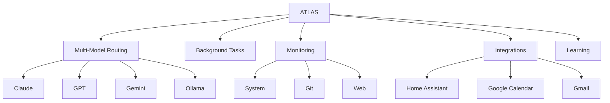

# ATLAS

> *"Very good, sir. I remain at your service."*

**Automated Thinking, Learning & Advisory System** - A refined British butler AI assistant with multi-model intelligence, proactive monitoring, and JARVIS-like awareness.

---

## Quick Navigation

### Getting Started
- [[Installation]] - Set up ATLAS on your system
- [[Quick Start]] - Your first conversation
- [[Configuration]] - Customize ATLAS behavior

### Core Features
- [[Multi-Model Routing]] - Intelligent AI selection
- [[Background Tasks]] - Queue and daemon
- [[Briefings]] - Morning, daily, end-of-day reports
- [[Memory System]] - Conversations, decisions, reminders

### Voice & Access
- [[Voice Interface]] - Whisper + Piper setup
- [[Hotkey Activation]] - Windows hotkey access

### Monitoring & Awareness
- [[Proactive Monitoring]] - System, git, web alerts
- [[Learning Engine]] - Pattern detection and anticipation

### Integrations
- [[Smart Home]] - Home Assistant control
- [[Calendar Integration]] - Google Calendar
- [[Email Integration]] - Gmail awareness

### Reference
- [[Commands]] - Complete command reference
- [[Configuration Reference]] - Full YAML options
- [[Troubleshooting]] - Common issues and fixes
- [[Python API]] - Programmatic usage

---

## At a Glance

```
./scripts/atlas
```

| Command | Action |
|---------|--------|
| `/help` | Show all commands |
| `/status` | Provider usage |
| `/morning` | Morning briefing |
| `/queue add <task>` | Background task |
| `/quit` | Exit |

---

## Feature Overview



---

## Tags

#atlas #documentation #ai-assistant #butler

---

## Recent Changes

- Initial documentation created
- All 11 phases documented
- Obsidian vault structure established
